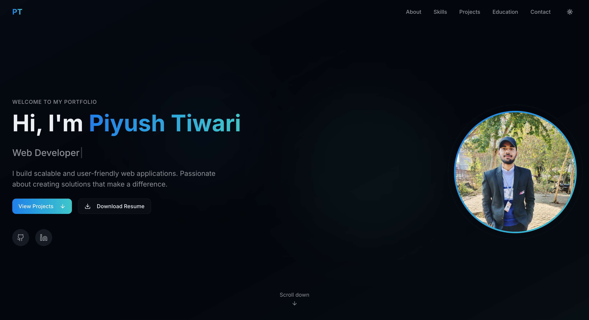
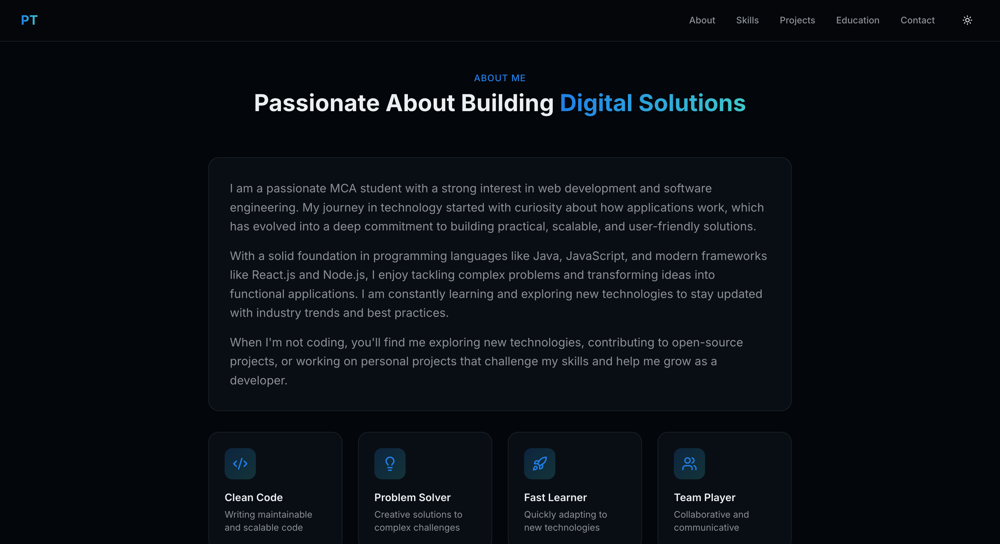
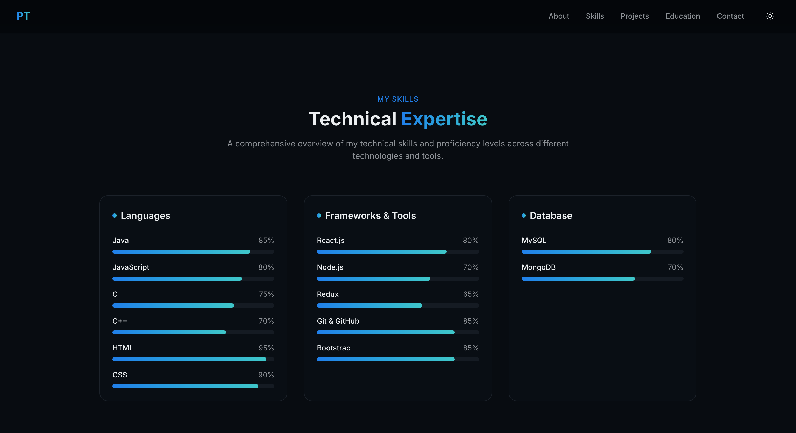
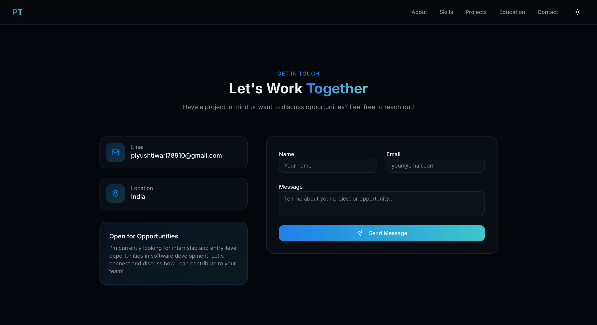

# Personal-Portfolio-Website
💼 Personal Portfolio Website is a responsive web application designed to showcase my skills, projects, and experience. It includes sections like About Me, Projects, Skills, and Contact. This portfolio helps in presenting my work professionally and building my online presence. 🚀
Features

## 👨‍💻 Author
Name: Hritik Tiwari
MCA Student
Passionate Web Developer 💻

##  About Me section
💼 Projects showcase
🛠️ Skills display
📄 Resume download option
📬 Contact form
📱 Fully responsive design

## 🛠️ Technologies Used
HTML
CSS
JavaScript

## ⚙️ How to Run Project
Download or clone repository
Open folder in VS Code
Open index.html in browser
👉 OR simply run using Live Server extension

## 🚀 Future Improvements
Add backend contact form (Node/PHP)
Add dark mode 🌙
Add animations and transitions
Improve UI/UX design

## 📜 License

This project is for personal and educational use only.

## 📸 Screenshots

### Home Page

### About Page

### Skill Page

### Projects  Page

### Contact   Page

